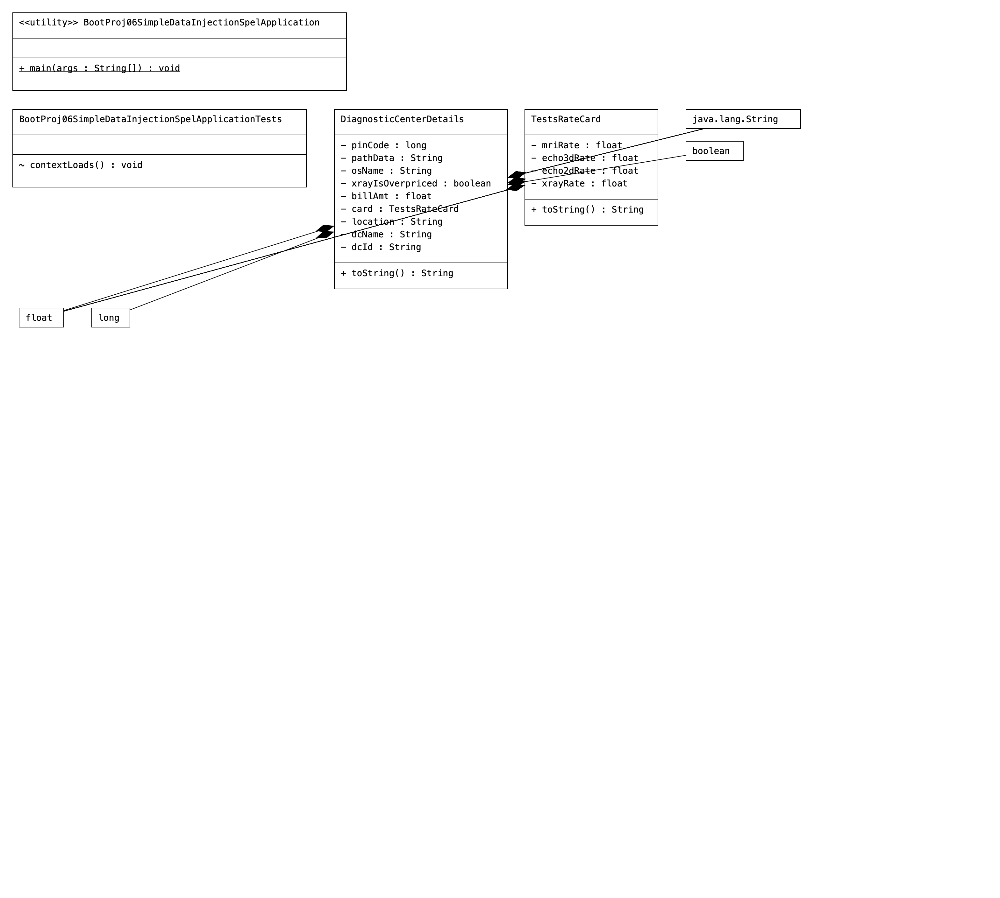

# bootproj06-simpledatainjection-spel
 
# Code
```Java
package com.reader.sbeans;

import org.springframework.beans.factory.annotation.Autowired;
import org.springframework.beans.factory.annotation.Value;
import org.springframework.stereotype.Component;

@Component("dcDetails")
public class DiagnosticCenterDetails {
    //injecting the properties files data
    @Value("${dc.id}")
    private String dcId;
    @Value("${dc.name}")
    private String dcName;
    @Value("${dc.location}")
    private String location;

    @Autowired
    private TestsRateCard card;

    @Value("#{tInfo.xrayRate + tInfo.echo2dRate + tInfo.echo3dRate}")  //SPEL
    private float billAmt;

    @Value("#{tInfo.xrayRate>=10000}")
    private boolean xrayIsOverpriced;

    @Value("${os.name}")  //system property injection
    private String osName;

    @Value("${Path}")  //env..variable  values injection
    private String pathData;

    @Value("500038")
    private long pinCode;

    //toString()
    @Override
    public String toString() {
        return "DiagnosticCenterDetails [dcId=" + dcId + ", dcName=" + dcName + ", location=" + location + ", card="
                + card + ", billAmt=" + billAmt + ", xrayIsOverpriced=" + xrayIsOverpriced + ", osName=" + osName
                + ", pathData=" + pathData + ", pinCode=" + pinCode + "]";
    }


}
```
```java
package com.reader.sbeans;

import lombok.Data;
import org.springframework.beans.factory.annotation.Value;
import org.springframework.stereotype.Component;

@Component("tInfo")
@Data
public class TestsRateCard {
    @Value("${test.xray}")
    private float xrayRate;
    @Value("${test.2decho}")
    private float echo2dRate;
    @Value("${test.3decho}")
    private float echo3dRate;
    @Value("${test.mri}")
    private float mriRate;

    //toString()
    @Override
    public String toString() {
        return "TestsRateCard [xrayRate=" + xrayRate + ", echo2dRate=" + echo2dRate + ", echo3dRate=" + echo3dRate
                + ", mriRate=" + mriRate + "]";
    }


}

```
```java
package com.reader;

import com.reader.sbeans.DiagnosticCenterDetails;
import org.springframework.boot.SpringApplication;
import org.springframework.boot.autoconfigure.SpringBootApplication;
import org.springframework.context.ApplicationContext;
import org.springframework.context.ConfigurableApplicationContext;

@SpringBootApplication
public class BootProj06SimpleDataInjectionSpelApplication {

    public static void main(String[] args) {
        //get IOC container
        ApplicationContext ctx = SpringApplication.run(BootProj06SimpleDataInjectionSpelApplication.class, args);
        //get Spring bean class obj ref
        DiagnosticCenterDetails details = ctx.getBean("dcDetails", DiagnosticCenterDetails.class);
        System.out.println(details);

        //close the container
        ((ConfigurableApplicationContext) ctx).close();
    }

}

```

```properties
spring.application.name=BootProj06-SimpleDataInjection-SPEL
#  Test prices
test.xray=3000
test.2decho=5000
test.3decho=7000
test.MRI=8000
#Diagnostic center Info
dc.id=3001
dc.name=LUCID
dc.location=hyd

```
# Dependencies
```xml
	<dependencies>
		<dependency>
			<groupId>org.springframework.boot</groupId>
			<artifactId>spring-boot-starter</artifactId>
		</dependency>

		<dependency>
			<groupId>org.springframework.boot</groupId>
			<artifactId>spring-boot-starter-test</artifactId>
			<scope>test</scope>
		</dependency>
		<dependency>
			<groupId>org.projectlombok</groupId>
			<artifactId>lombok</artifactId>
			<optional>true</optional>
		</dependency>
	</dependencies>
```


# UML
